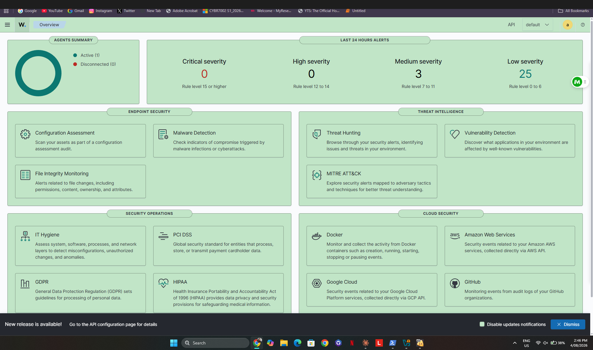
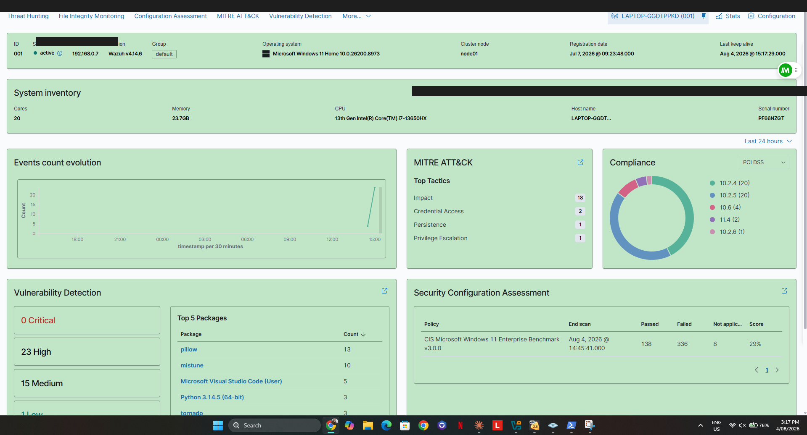
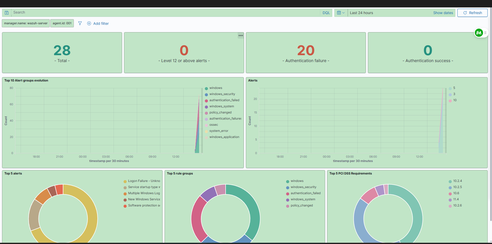
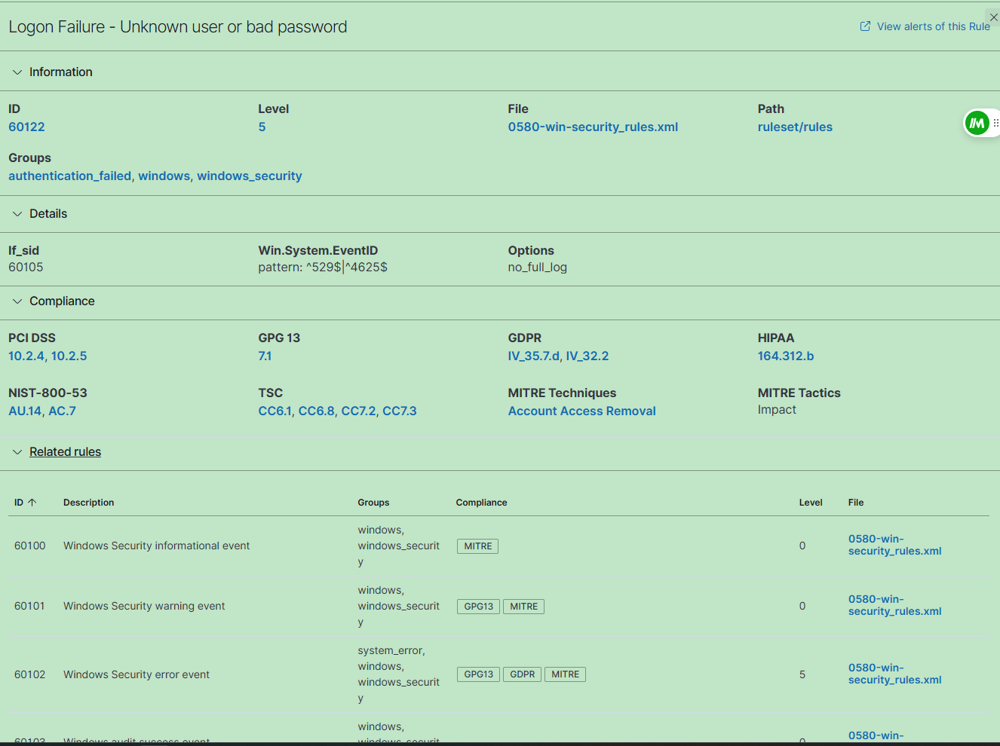
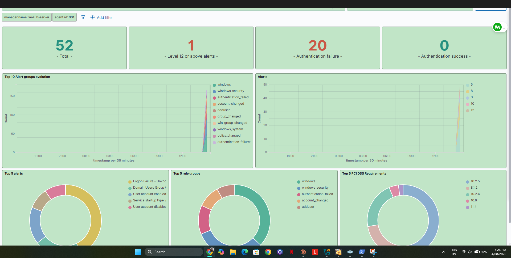
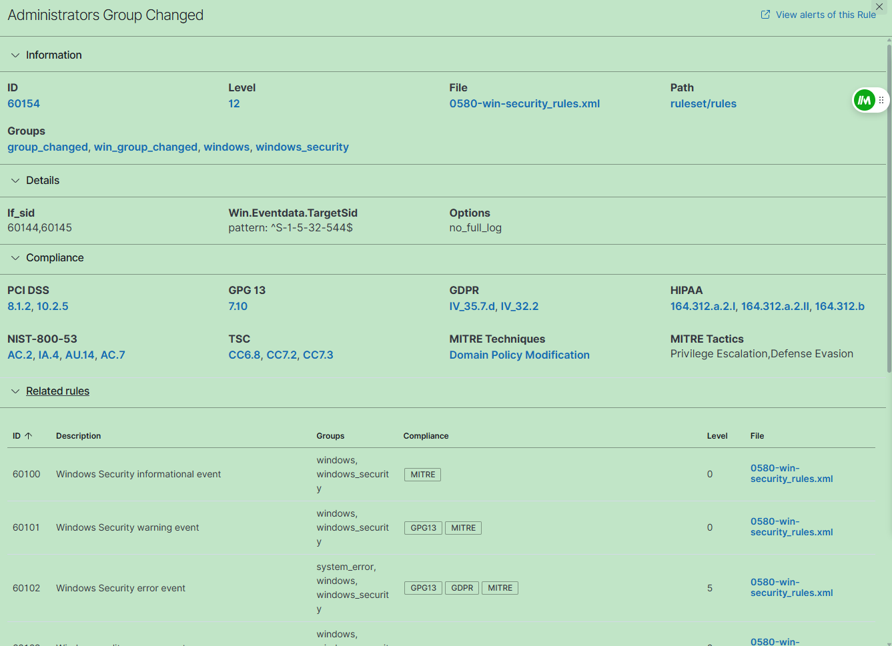

# Wazuh SIEM Home Lab — Simulated Attack & Incident Response

I built this project to practice blue team skills in a safe, isolated environment. The goal was simple: simulate a real attack chain, see what Wazuh catches, and document it the way a SOC analyst would.

Everything here — the attack, the detection, the report — was done on my personal laptop using VirtualBox. No real systems were touched.

---

## What I did

I ran a 3-phase simulated attack against a Windows 11 endpoint monitored by Wazuh SIEM:

1. **Reconnaissance** — scanned the machine with Nmap to find open ports and identify services
2. **Brute force** — simulated repeated failed login attempts to trigger authentication alerts
3. **Persistence** — created a rogue local admin account to simulate post-compromise behaviour

Then I documented everything as a formal incident response report, mapped findings to MITRE ATT&CK and compliance frameworks, and cleaned up all artefacts.

---

## Tools used

- **Wazuh v4.14.6** — SIEM for detection and alerting
- **Nmap 7.99** — port scanning and service fingerprinting
- **PowerShell** — attack simulation and remediation
- **VirtualBox** — running the Wazuh Manager VM
- **Windows 11** — target endpoint with Wazuh agent installed

---

## Lab setup

A Wazuh OVA virtual machine runs on VirtualBox on my Lenovo Legion 5 (i7-13650HX, 23.7GB RAM). The Wazuh agent is installed directly on the Windows 11 host and reports back to the Wazuh Manager VM over a private network.

---

## Attack timeline

| Time | Phase | What happened |
|---|---|---|
| 14:53 | Recon | Nmap SYN scan — found ports 135, 139, 445 open |
| 14:54 | Discovery | Service scan confirmed SMB and Windows OS |
| 15:10 | Brute force | 10 failed login attempts — 20 auth failure events generated |
| 15:11 | 🚨 Detection | Wazuh Rule 60204 fired — Multiple Windows Logon Failures (Level 10) |
| 15:22 | Persistence | Rogue admin account "hacker" created and added to Administrators |
| 15:22 | 🔴 Critical alert | Wazuh Rule 60154 — Administrators Group Changed (Level 12) |
| 15:25 | Remediation | Rogue account removed, policy restored |
| 15:26 | ✅ Verified clean | No unauthorised accounts remaining |

---

## What Wazuh detected

### Agent active before the attack began

---

### Windows endpoint — MITRE ATT&CK tactics and CIS Benchmark

---

### Brute force phase — 28 alerts, 20 authentication failures

The burst of failed logins triggered Wazuh's brute-force detection almost immediately.

---

### Rule 60122 detail — failed logon (Windows Event ID 4625)

Every failed attempt fired this rule. What I found interesting is how Wazuh automatically maps it to compliance frameworks — this single alert touches PCI DSS, GDPR, HIPAA, and NIST 800-53 simultaneously.

---

### After the persistence phase — 52 alerts, 1 critical

Creating the rogue account and adding it to Administrators caused a spike. Alert count jumped from 28 to 52 and new groups appeared: `adduser`, `group_changed`, `win_group_changed`.

---

### Rule 60154 — Administrators Group Changed (Level 12 Critical)

This was the most significant detection. In a real SOC, a Level 12 alert would page an analyst immediately. Wazuh mapped it to MITRE T1484 (Domain Policy Modification) under Privilege Escalation and Defense Evasion.

---

## Key findings

- Wazuh detected all 3 attack phases without any custom rule tuning
- The brute force detection escalated automatically from individual failures (Rule 60122, Level 5) to an aggregate alert (Rule 60204, Level 10)
- The rogue admin account triggered a Level 12 critical alert within seconds of creation
- All alerts were automatically mapped to PCI DSS, GDPR, HIPAA, and NIST 800-53 — useful for compliance reporting

---

## What I'd fix in a real environment

- Enable account lockout after 5 failed attempts (no lockout policy was configured)
- Block SMB port 445 at the firewall for non-domain traffic
- Require MFA before adding users to privileged groups
- Configure Wazuh active response to auto-block brute force source IPs
- Work through the CIS Windows 11 Benchmark failures (current score: 138/482)

---

## Reflections

This was a great way to connect theory to practice. Reading about brute force detection is one thing — watching Wazuh light up in real time as the failed logins came in is another. The compliance mapping was also a useful reminder of how a single security event can have implications across multiple regulatory frameworks at once.

---

*Ida Jenifer Jayaprakasam — Master of Cybersecurity (Cyber Defence), University of Queensland*  

